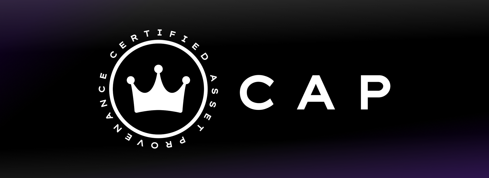

# Welcome to CAP 👋

Welcome to CAP's documentation. CAP is an open internet service providing transaction history & asset provenance for NFT’s & Tokens on the Internet Computer. It solves the huge IC problem that assets don’t have native transaction history, and does so in a scalable, trustless and seamless way so any NFT/Token can integrate with one line of code.

CAP provides services to:
1. NFTs/Tokens developers by giving them a plug-n-play history for their assets.
2. UIs/Dapps/Sites on the Internet Computer that want to show an asset's history to users.

!!! Important

    CAP is currently in development 🚧 and will release in the first week of November. This documentation is a placeholder and overview of the project, and once it is released and open-sourced the technical guides, and documentation will be fully added.

- Visit [our website](https://cap.ooo)
- Read [our announcement](https://medium.com/@cap_ois/db9bdfe9129f?source=friends_link&sk=924b190ea080ed4e4593fc81396b0a7a)
- Visit [CAP's main repository](https://github.com/psychedelic/cap) (In development)
- Visit [CAP-SDK repository](#) (Early look)
- Visit [CAP-JS repository](#) (Early look)

## 👑 CAP - Certified Asset Provenance

CAP is an open internet service on the Internet Computer that developers can utilize to give their NFT, Token (and soon many more NFTs/Tokens) traceability and provenance, with a transaction/history service.

- [Visit the overview section to learn more about how it works.](https://docs.cap.ooo/overview/what-is-cap/)

## 🧰 Getting Started with CAP - (Soon!)

Integrating CAP takes only a couple lines of code using our CAP SDK tool, which facilitates integrating your asset's canister (NFT collection or token) to CAP, spawning a history archive canister for your specific Token or NFT.

### 🛢️ Integrating NFT/Token Canister to CAP to give it a History.

Looking to integrate CAP to an NFT or Token to give it a transaction/activity history in CAP? 

1. Get started with the CAP SDK.
2. View our example NFT implementation.
3. View our example Token implementation.
4. Use our NFT standard, built-in with CAP.

### 📈 Integrating CAP to an UI/App to Show an Assets History/Activity.

Want to query data from CAP from your UI/App/Dapp website? With CAP you can provide your users with great UI/UX's by:

Displaying historic data of an asset (e.g. NFT's past sales and transfers); showing transaction history of custom tokens in your platform; or by creating UI's with general asset statistics (consuming all data in CAP!).

- Get started with the CAP-js library.
- See our CAP Explorer UI as an example.

## 🔌👑 Plug, Moonwalkers, and other Early Supporters

We are kickstarting the CAP ecosystem with a group of early Tokens & NFTs that will be integrating CAP to give their NFTs/Token an activity history!

- [Moonwalkers (NFTs)](https://twitter.com/ic_gallery)
- [Portal (NFTs)](https://portal.one/)
- [DFinance (Tokens)](https://dfinance.ai/)
- [Cycles Token (Tokens)](https://dank.ooo/xtc/)
- [ICSnakes (NFTs)](https://xn--4n8h7h.ws/)
- [ICPSquad (NFTs)](https://twitter.com/ICPSquadNFT)

As for **Plug's integration**, it isn't only to show users the transaction history of tokens/NFTs in their wallet that support Plug. With CAP, Plug can provide its users with transaction history data regardless of whether the NFT or Token has integrated CAP yet.

A partial transaction history will be integrated through Plug in CAP, which will **seed** the information so that users **can always see where the assets in their wallet went, and what happened to them**. When the NFT/Token decides to fully integrate CAP, it can seamlessly continue this transaction history natively.